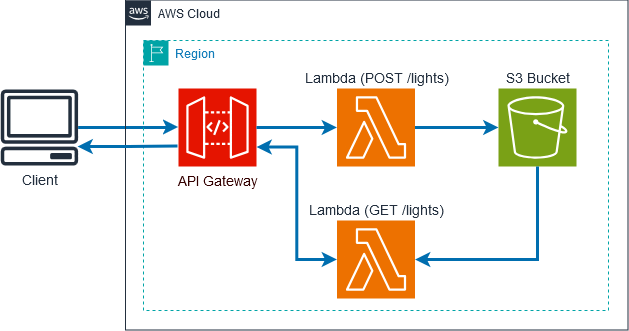

# light-schedule-service

Serverless REST API integrating functionalities from WpwilsonSite and sunrise-lamp-aws.

## Description

This project provides a service that allows for saving and retrieving a configuration file for controlling the lighting control system implemented in [sunrise-lamp-aws](https://github.com/wpwilson10/sunrise-lamp-aws) using the core AWS infrastructure implemented in [WpwilsonSite](https://github.com/wpwilson10/WpwilsonSite). This service provides the integration between those projects using AWS Lambda functions to store and retrieve configuration files in Amazon S3, making it easy to manage and update lighting configurations remotely.

The architecture for this project follows [AWS's RESTful microservices scenario](https://docs.aws.amazon.com/wellarchitected/latest/serverless-applications-lens/restful-microservices.html) which is a serverless application framework and part of AWS's recommended Well-Architected Framework. By using an API Gateway which calls Lambda functions backed by an S3 bucket, this solution is scalable, distributed, and fault-tolerant by default.



## Setup

### Configuration

Create a terraform.tfvars file under ./terraform and configure as desired.

Required variables:

- api_gateway - the ID of the API Gateway with which this service integrates

See variables.tf for more information.

### Deploy

Once the configuration above is complete, run the following commands from the ./terraform directory.

```
terraform init
terraform plan
terraform apply
```

## Usage

### Required Headers

All requests must include the following authentication header:

```
x-custom-auth: your-secret-token
```

### Save Configuration

To save a configuration file, send a POST request to the endpoint exposed by the API Gateway with the configuration JSON as the body.

The format of the JSON payload should match the following interfaces:

```typescript
interface BrightnessScheduleEntry {
  time: string; // Time in 24-hour format (HH:mm)
  unixTime: number; // Unix timestamp for this entry
  warmBrightness: number; // Warm light brightness (0-100)
  coolBrightness: number; // Cool light brightness (0-100)
  label: string; // Entry identifier (e.g., "sunrise", "sunset")
}

interface ScheduleData {
  mode: 'dayNight' | 'scheduled' | 'demo'; // Operating mode
  serverTime: number; // Current server Unix timestamp
  brightnessSchedule: BrightnessScheduleEntry[]; // Unified schedule array (sorted by unixTime)
}
```

For complete API documentation, see [docs/api_contract.md](./docs/api_contract.md).

Example request:

```
POST https://api.example.com/lights
x-custom-auth: your-secret-token

{
  "mode": "dayNight",
  "brightnessSchedule": [
    {"time": "06:30", "warmBrightness": 25, "coolBrightness": 0, "label": "civil_twilight_begin"},
    {"time": "07:00", "warmBrightness": 75, "coolBrightness": 100, "label": "sunrise"},
    {"time": "19:30", "warmBrightness": 75, "coolBrightness": 100, "label": "sunset"},
    {"time": "20:00", "warmBrightness": 100, "coolBrightness": 0, "label": "civil_twilight_end"},
    {"time": "23:00", "warmBrightness": 100, "coolBrightness": 0, "label": "bed_time"},
    {"time": "23:30", "warmBrightness": 25, "coolBrightness": 0, "label": "night_time"}
  ]
}
```

### Retrieve Configuration

To retrieve the current configuration:

```
GET https://api.example.com/lights
x-custom-auth: your-secret-token
```

Example response:

```json
{
  "mode": "dayNight",
  "serverTime": 1706745600,
  "brightnessSchedule": [
    {"time": "06:30", "unixTime": 1706785800, "warmBrightness": 25, "coolBrightness": 0, "label": "civil_twilight_begin"},
    {"time": "07:00", "unixTime": 1706787600, "warmBrightness": 75, "coolBrightness": 100, "label": "sunrise"},
    {"time": "19:30", "unixTime": 1706832600, "warmBrightness": 75, "coolBrightness": 100, "label": "sunset"},
    {"time": "20:00", "unixTime": 1706834400, "warmBrightness": 100, "coolBrightness": 0, "label": "civil_twilight_end"},
    {"time": "23:00", "unixTime": 1706845200, "warmBrightness": 100, "coolBrightness": 0, "label": "bed_time"},
    {"time": "23:30", "unixTime": 1706847000, "warmBrightness": 25, "coolBrightness": 0, "label": "night_time"}
  ]
}
```

The `brightnessSchedule` array contains all schedule entries sorted chronologically by `unixTime`. Clients use this array directly for scheduling - no client-side timestamp computation needed.

## Features

The service handles time updates automatically in several ways:

### DayNight Mode

When operating in "dayNight" mode:

- Sunrise/sunset times are fetched based on the user's geolocation (from IP address)
- Daytime events (sunrise, sunset, dusk, dawn) are updated with actual times for the current location
- Each light event gets a unix timestamp for the current day
- A minimum sunset time of 19:30 is enforced to prevent early darkness in winter
- If sunset is before 19:30, dusk is set to 30 minutes after sunset
- Default sleep schedule (bed_time: 23:00, night_time: 23:30) is applied if not set
- `unixTime` values are recomputed on every GET request based on current date and client timezone (from IP geolocation). There is no server-side scheduled update; freshness comes from the Pico (or frontend) calling GET.

### Scheduled Mode

The API accepts "scheduled" mode but there is no frontend UI for creating custom schedules currently. Only dayNight and demo modes have active frontend support.
